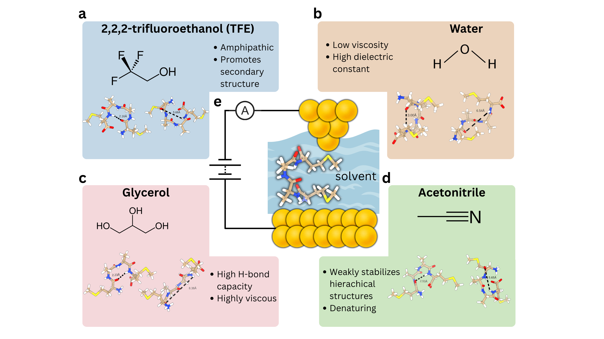

# Solvent Electron Transport in Peptides (2025)

This repository contains sample molecular dynamics simulation scripts, analysis scripts to analyze the trajectory data and the featurized trajectories (.pkl files) from the paper (INSERT WHEN SUBMITTED)

---

## What’s in this repository?

### ✅ `analysis_scripts/`

This folder includes high-level Python scripts to analyze features extracted from MD simulations.

- `4mer_main_analysis.py`: Analyzes 4-mer peptides across different solvents. It processes the features and hydrogen bonding data to produce the main text and supporting information figures for the manuscript.
- `5mer_main_analysis.py`: Similar to the 4-mer script but focused on 5-mer peptide systems, including more complex hydrogen bonding patterns.

---

### `feature_pkls/`

This folder contains preprocessed features saved as `.pkl` files (Python pickles),further analysis. The features are divided by peptide length (4-mer vs 5-mer) and solvent conditions.

#### For 4-mers:
- Files like `feats_acn.pkl`, `feats_water.pkl`, etc., contain features for different solvents. These are residue-residue contacts in addition to the hydrogen bond distance features.
- Files starting with `feats_HO_*.pkl` contain **hydrogen bond distance features only**, e.g., `feats_HO_tfe.pkl` corresponds to 4-mer hydrogen bond distances in TFE.

#### For 5-mers:
- Files like `feat_H_14_acn.pkl`, `feat_H_25_tfe.pkl`, etc., represent **specific hydrogen bonds**, such as:
  - `H_14`: hydrogen bond between residues 1 and 4
  - `H_15`: between residues 1 and 5
  - `H_25`: between residues 2 and 5
- These are provided across solvents (acetonitrile, glycerol, TFE).
- General feature files (e.g., `feats_acn.pkl`) are also provided for the 5-mers.

---

### `simulation_scripts/`

This folder contains scripts for setting up and running MD simulations of peptides in various solvents.

- `minimization_NVT.py`: Minimizes the system energy and performs simulations in the NVT ensemble.
- `NPT.py`: Runs simulations under constant pressure and temperature (NPT), with protein backbone atoms restrained .
- `equilibration.py`: Equilibrates the system before production in the NPT ensemble, with no restraints on the protein backbone.
- `production.py`: Carries out the final production run for analysis in the NPT ensemble.

---

## Citation

If you use this repository or its contents in your work, please cite the associated publication (to be added once published).

---

